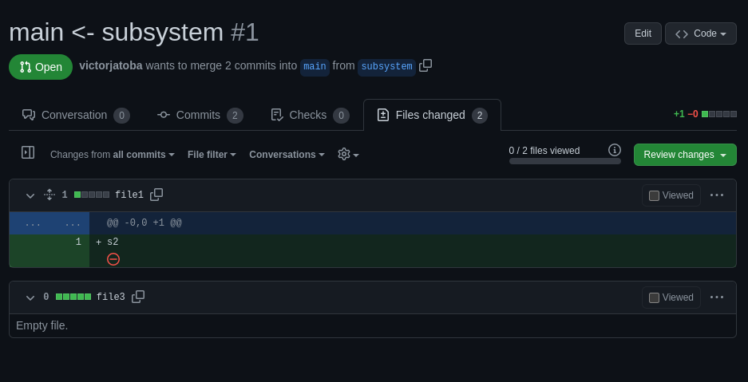
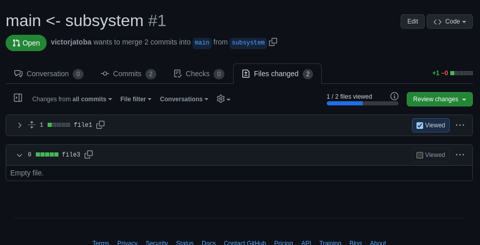
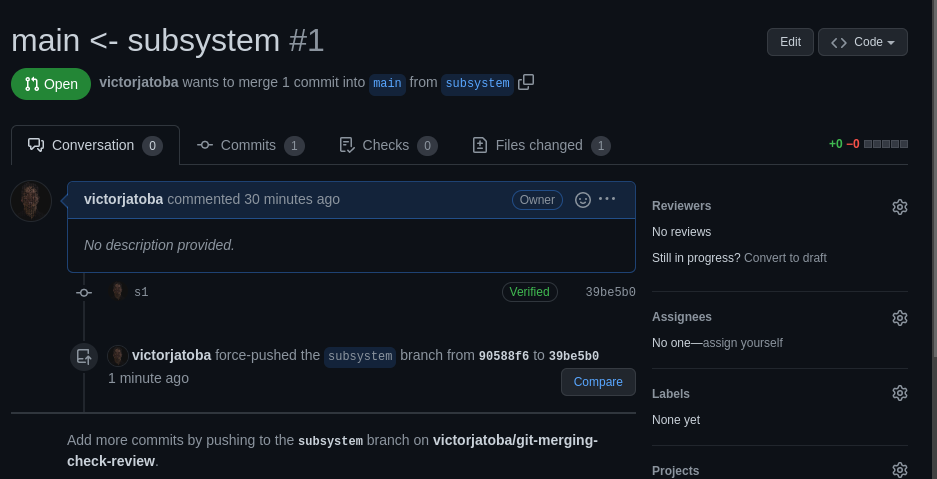
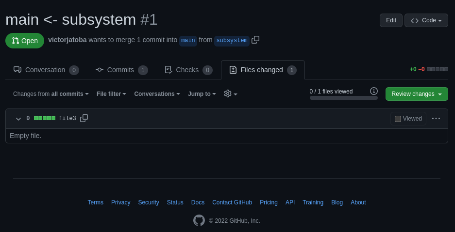

# Testar a marcação do "check" de visualizado das alterações

```fs
m0---m1---m2  (main)
           \
            s1---s2  (subsystem)
```

- subsystem faz alteração no file1 (commit s2)

> subsystem log

```sh
90588f6 (HEAD -> subsystem, origin/subsystem) s2
c256df5 s1
65dea0b m2
b4f2a89 m1
99590bb Initial commit
```

- PR criado



- file1 foi marcado como visualizado



- topic faz a mesma alteração de subsystem (commit t1)

```fs
            t1  (topic)
           /
m0---m1---m2  (main)
           \
            s1---s2  (subsystem)
```

- main faz merge com topic

> main log

```sh
b7b7a78 (HEAD -> main, origin/topic, origin/main, origin/HEAD, topic) t1
65dea0b m2
b4f2a89 m1
99590bb Initial commit
```

```fs
            t1  (topic)
           /
m0---m1---m2---t1  (main)
           \
            s1---s2  (subsystem)
```

- subsystem faz rebase com main

> subsystem log

```sh
39be5b0 (HEAD -> subsystem) s1
b7b7a78 (origin/topic, origin/main, origin/HEAD, topic, main) t1
65dea0b m2
b4f2a89 m1
99590bb Initial commit
```

```fs
            t1  (topic)
           /
m0---m1---m2---t1  (main)
                \
                 s1'  (subsystem)
```

- s2 sumiu após rebase



- fil1 desaparece da aba "Files changed"


