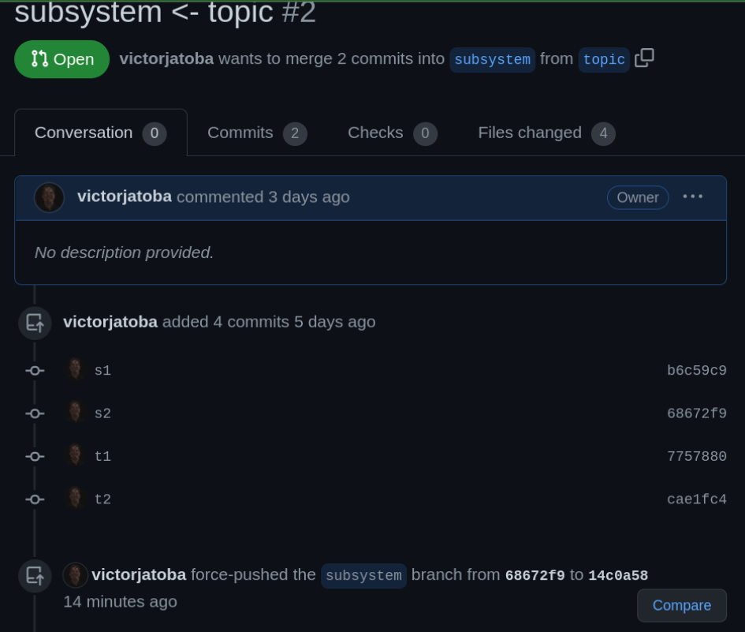
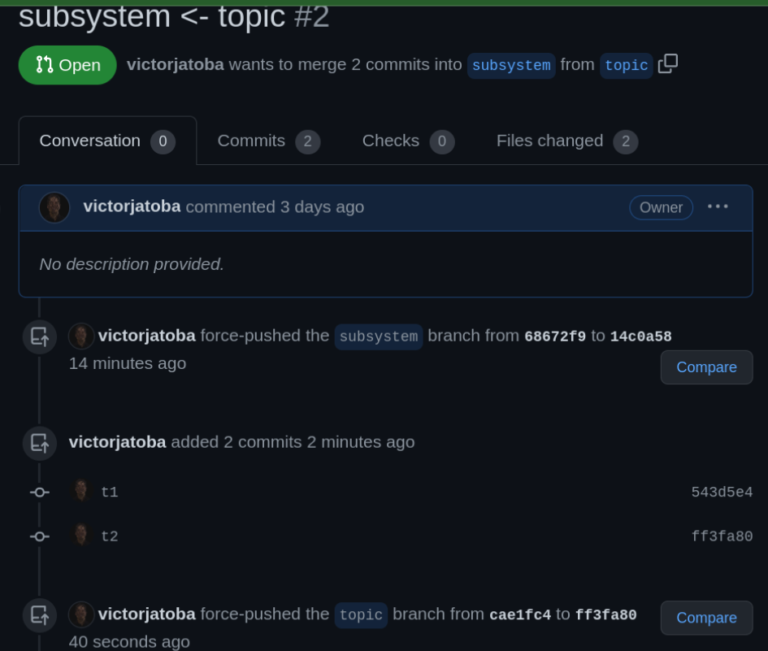
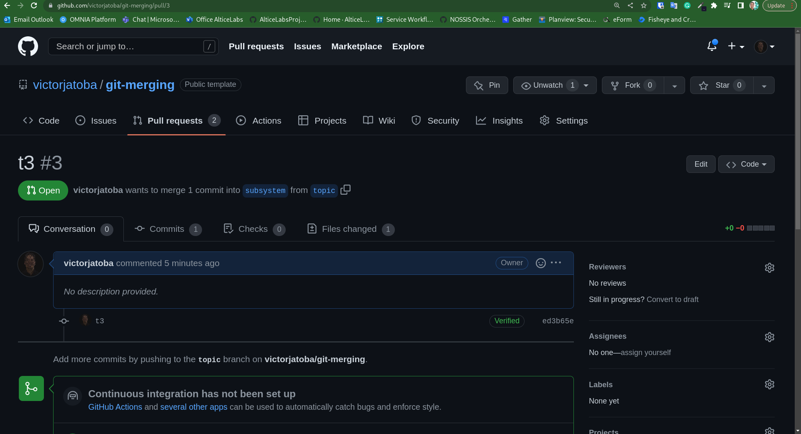
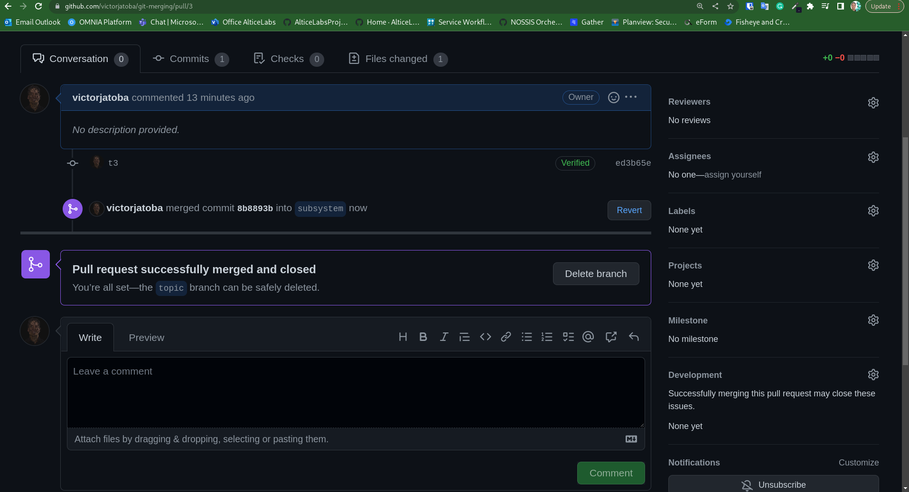
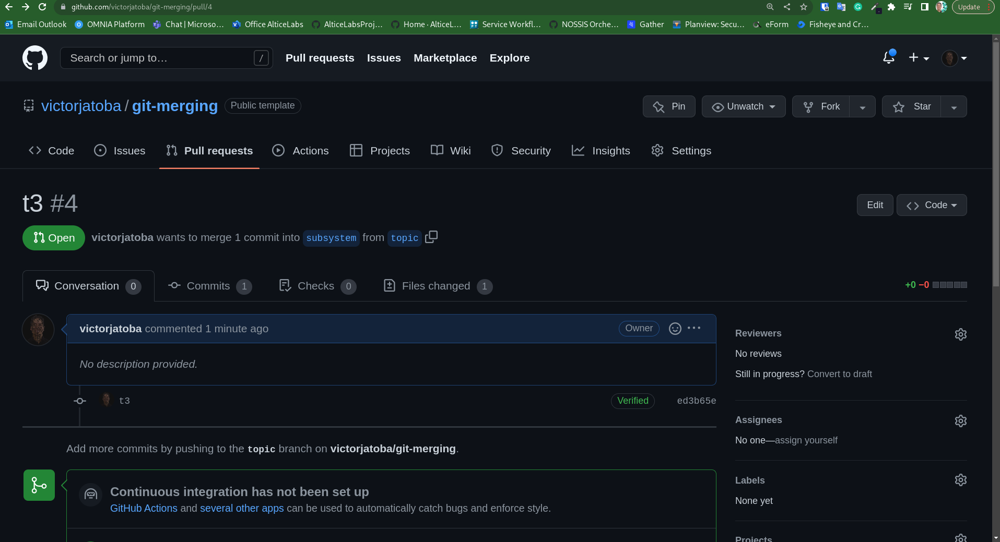

# Git merging approach study

## repository branch commits

### History of commits by branch

```fs
m0---m1---m2---m3---m4  (main)
           \
            s1---s2  (subsystem)
                  \
                   t1---t2  (topic)
```

### subsystem log

```sh
git checkout subsystem
git log --oneline
```

console result:

```fs
68672f9 (HEAD -> subsystem, origin/subsystem) s2
b6c59c9 s1
b84f763 (origin/main, origin/HEAD) m2
a9fa694 m1
8563cc8 Initial commit
```

### main log

```sh
git checkout main
git log --oneline
```

```fs
c178ff2 (HEAD -> main, origin/main, origin/HEAD) m4
53a50b6 m3
b84f763 m2
a9fa694 m1
8563cc8 Initial commit
```

## REBASE

```sh
git checkout subsystem
git rebase main
```

```fs
git log --oneline

14c0a58 (HEAD -> subsystem) s2
447880b s1
c178ff2 (origin/main, origin/HEAD, main) m4
53a50b6 m3
b84f763 m2
a9fa694 m1
8563cc8 Initial commit
```

```fs
m0---m1---m2---m3---m4  (main)
                     \
                      s1'---s2'  (subsystem)
```

### Conclusion

- The commits' hash: s1, s2, m3 and m4 was modified. For example, the "s1" commit changed from `b6c59c9` to `6dfe7c9` and "m3" changed from `53a50b6` to `202369c`.
- subystem's commits go to final (HEAD)

## MERGE

```sh
git checkout subsystem
git merge main
git commit -m "s3 merge"
```

```fs
git log --oneline

d51d8af (HEAD -> subsystem) s3 merge
c178ff2 (origin/main, origin/HEAD, main) m4
53a50b6 m3
68672f9 (origin/subsystem) s2
b6c59c9 s1
b84f763 m2
a9fa694 m1
8563cc8 Initial commit
```

```fs
m0---m1---m2---m3---m4  (main)
           \    \    \
            s1   \    \
             \    \    \
              s2---m3---m4---M  (subsystem)
```

### Conclusion

- The hash's doesn't modified.
- Added one more commit.
- Keep the commits' sequence.

## MERGE SQUASH

```sh
git checkout subsystem
git merge --squash main
git commit -m "s3 merge squash"
```

```fs
git log --oneline

157f993 (HEAD -> subsystem) s3 merge squash
68672f9 (origin/subsystem) s2
b6c59c9 s1
b84f763 m2
a9fa694 m1
8563cc8 Initial commit
```

```fs
m0---m1---m2---m3---m4  (main)
          |      \  /
          |       \/ "squashed"
          |        \
          s1---s2---M  (subsystem)
```

### Conclusion

- Add one more commit (M) with the m3 and m4 alterations
- m3 and m4 commits went out.
- The subsystem's hash doesn't modified.

### REBASE --ONTO

```sh
git checkout subsystem
```

```fs
git log --oneline

68672f9 (HEAD -> subsystem, origin/subsystem) s2
b6c59c9 s1
b84f763 m2
a9fa694 m1
8563cc8 Initial commit
```

> `68672f9` (the last commit SHA1 in the pre-rebase)

### Rebase para main

```sh
git rebase main
```

```fs
git log --oneline

14c0a58 (HEAD -> subsystem, origin/subsystem) s2
447880b s1
c178ff2 (origin/main, origin/HEAD, main) m4
53a50b6 m3
b84f763 m2
a9fa694 m1
8563cc8 Initial commit
```

```fs
m0---m1---m2---m3---m4  (main)
           \         \
            s1---s2   s1'---s2' (subsystem)
                  \
                   t1---t2  (topic)
```



### Rebase --onto referenciando o commit s2

```sh
git checkout topic
```

```fs
git log --oneline

cae1fc4 (HEAD -> topic, origin/topic) t2
7757880 t1
68672f9 s2
b6c59c9 s1
b84f763 m2
a9fa694 m1
8563cc8 Initial commit
```

```sh
git rebase --onto subsystem 68672f9 topic
```

```fs
git log --oneline

ff3fa80 (HEAD -> topic) t2
543d5e4 t1
14c0a58 (origin/subsystem, subsystem) s2
447880b s1
c178ff2 (origin/main, origin/HEAD, main) m4
53a50b6 m3
b84f763 m2
a9fa694 m1
8563cc8 Initial commit
```

```fs
m0---m1---m2---m3---m4  (main)
                     \
                      s1'---s2'  (subsystem)
                             \
                              t1'---t2'  (topic)
```

PR para o substystem


Antes e depois


### Rebase normal

```sh
git checkout subsystem
Criei o commit s3
git push
```

```fs
git log --oneline

1871f8f (HEAD -> subsystem, origin/subsystem) s3
14c0a58 s2
447880b s1
c178ff2 (origin/main, origin/HEAD, main) m4
53a50b6 m3
b84f763 m2
a9fa694 m1
8563cc8 Initial commit
```

```fs
m0---m1---m2---m3---m4  (main)
                     \
                      s1'---s2'---s3  (subsystem)
                             \
                              t1'---t2'  (topic)
```

```sh
git checkout topic
git rebase subsystem
```

```fs
git log --oneline

abfc28a (HEAD -> topic) t2
36fb52b t1
1871f8f (origin/subsystem, subsystem) s3
14c0a58 s2
447880b s1
c178ff2 (origin/main, origin/HEAD, main) m4
53a50b6 m3
b84f763 m2
a9fa694 m1
8563cc8 Initial commit
```

```fs
m0---m1---m2---m3---m4  (main)
                     \
                      s1'---s2'---s3  (subsystem)
                                   \
                                    t1''---t2''  (topic)
```

No PR abaixo, percebe-se que os commits t1 e t2 mudaram o hash


### Merge

- No PR (subsystem <- topic) foi feito um Merge para subsystem
- O commit do merge foi nomeado de forma ilustrativa como MS1


```sh
git checkout subsystem
git pull
```

```sh
git log --oneline

e3deb43 (HEAD -> subsystem, origin/subsystem) MS1
abfc28a t2
36fb52b t1
1871f8f s3
14c0a58 s2
447880b s1
c178ff2 (origin/main, origin/HEAD, main) m4
53a50b6 m3
b84f763 m2
a9fa694 m1
8563cc8 Initial commit
```

```fs
m0---m1---m2---m3---m4  (main)
                     \
                      s1'---s2'---s3---t1''---t2''---MS1  (subsystem)
                             \
                              t1''---t2''  (topic)
```

### REBASE AND MERGE

```sh
git checkout topic
criei o commit t3
git push
```

```sh
git log --oneline

ed3b65e (HEAD -> topic, origin/topic) t3
abfc28a t2
36fb52b t1
1871f8f (origin/subsystem, subsystem) s3
14c0a58 s2
447880b s1
c178ff2 (origin/main, origin/HEAD, main) m4
53a50b6 m3
b84f763 m2
a9fa694 m1
8563cc8 Initial commit
```

```fs
m0---m1---m2---m3---m4  (main)
                     \
                      s1'---s2'---s3---t1''---t2''---MS1  (subsystem)
                             \
                              t1''---t2''---t3  (topic)
```

- Feito PR subsystem <- topic
- Apenas t3 divergindo



- No PR 2 subsystem <- topic foi feito um "REBASE AND MERGE" ao invés de apenas "Merge"



```sh
git checkout subsystem
git pull
```

```
git log --oneline

8b8893b (HEAD -> subsystem, origin/subsystem) t3
e3deb43 MS1
abfc28a t2
36fb52b t1
1871f8f s3
14c0a58 s2
447880b s1
c178ff2 (origin/main, origin/HEAD, main) m4
53a50b6 m3
b84f763 m2
a9fa694 m1
8563cc8 Initial commit
```

```fs
m0---m1---m2---m3---m4  (main)
                     \
                      s1'---s2'---s3---t1''---t2''---MS1---t3'  (subsystem)
                             \
                              t1''---t2''---t3  (topic)
```

- Feito PR subsystem <- topic
- O PR apresentou o t3 como commit a ser mesclado (merged) porém a alteração file10 já está na branch subsystem, com o t3'



## Good practices

"The golden rule of git rebase is to never use it on public branches." [Atlassian, 2022](https://www.atlassian.com/git/tutorials/merging-vs-rebasing#the-golden-rule-of-rebasing)

## Reference

[Git official documentation](https://git-scm.com/docs/git-rebase)