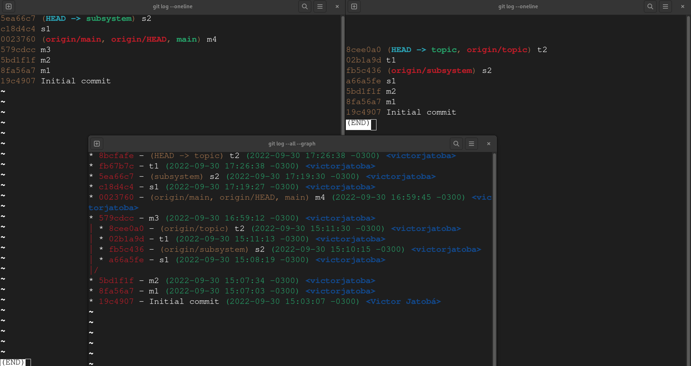

# REBASE --onto

--onto <newbase>
Starting point at which to create the new commits. If the --onto option is not specified, the starting point is <upstream>. May be any valid commit, and not just an existing branch name. [Citation](https://git-scm.com/docs/git-rebase#Documentation/git-rebase.txt---ontoltnewbasegt)

## Transplant

To transplant a topic branch based on one branch (subsystem) to another (main)

```fs
o---o---o---o---o  master
     \
      o---o---o---o---o  subsystem
                       \
                        o---o---o  topic
```

```fs
o---o---o---o---o  master
    |            \
    |             o'--o'--o'  topic
     \
      o---o---o---o---o  subsystem
```

## Replace part of a branch

Another example of --onto option is to rebase part of a branch. If we have the following situation:

```fs
E---F---G---H---I---J  topic
```

`git rebase --onto topicA~5 topicA~3 topicA`

```fs
E---H'---I'---J'  topicA
```

## Git rebase

`git rebase --onto subsystem SHA1 topic`

```fs
m---m---m---m---m---m---m---m  master
     \                       \
      \                       o'--o'--o'--o'--o'  subsystem
       \                     /   /   /   /   /
        --------------------o---o---o---o---o
                                             \
                                              *---*---*  topic
```

```fs
m0---m1---m2---m3---m4  (main)
                     \
                      s1'---s2'  (subsystem)
                             \
                              t1---t2  (topic)
```

fb5c436 s2
a66a5fe s1


```sh
git rebase --onto subsystem a66a5fe topic

dropping fb5c4360f33b756403ac2ee87b07d7810177c247 s2 -- patch contents already upstream
```

```sh
git log --oneline

8bcfafe (HEAD -> topic) t2
fb67b7c t1
5ea66c7 (subsystem) s2
c18d4c4 s1
0023760 (origin/main, origin/HEAD, main) m4
579cdcc m3
5bd1f1f m2
8fa56a7 m1
19c4907 Initial commit
```

```sh
* 8bcfafe - (HEAD -> topic) t2 (2022-09-30 17:26:38 -0300) <victorjatoba>
* fb67b7c - t1 (2022-09-30 17:26:38 -0300) <victorjatoba>
* 5ea66c7 - (subsystem) s2 (2022-09-30 17:19:30 -0300) <victorjatoba>
* c18d4c4 - s1 (2022-09-30 17:19:27 -0300) <victorjatoba>
* 0023760 - (origin/main, origin/HEAD, main) m4 (2022-09-30 16:59:45 -0300) <victorjatoba>
* 579cdcc - m3 (2022-09-30 16:59:12 -0300) <victorjatoba>
| * 8cee0a0 - (origin/topic) t2 (2022-09-30 15:11:30 -0300) <victorjatoba>
| * 02b1a9d - t1 (2022-09-30 15:11:13 -0300) <victorjatoba>
| * fb5c436 - (origin/subsystem) s2 (2022-09-30 15:10:15 -0300) <victorjatoba>
| * a66a5fe - s1 (2022-09-30 15:08:19 -0300) <victorjatoba>
|/  
* 5bd1f1f - m2 (2022-09-30 15:07:34 -0300) <victorjatoba>
* 8fa56a7 - m1 (2022-09-30 15:07:03 -0300) <victorjatoba>
* 19c4907 - Initial commit (2022-09-30 15:03:07 -0300) <Victor Jatobá>
```



## --keep-base

### Citation

Set the starting point at which to create the new commits to the merge base of `<upstream>` and `<branch>`. Running `git rebase --keep-base <upstream> <branch>` is equivalent to running `git rebase --onto <upstream>...<branch> <upstream> <branch>`. [Citation](https://git-scm.com/docs/git-rebase#Documentation/git-rebase.txt---keep-base)

`<upstream>`
Upstream branch to compare against. May be any valid commit, not just an existing branch name. Defaults to the configured upstream for the current branch.

`<branch>`
Working branch; defaults to HEAD.

## Reference

https://git-scm.com/docs/git-rebase
